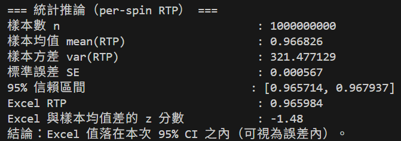

# slot10_50_100_C++

- Slot simulator demo

- 模擬遊戲數據，輸出各項統計資料

- 遊戲規則與程式流程請見程式檔頭註解

## 環境需求
- Windows 10/11
- C++17
  - MSVC（Visual Studio 2022）

## 開發工具(建議)
- Visual Studio Code
    - 擴充：C/C++
- Visual Studio 2022
    - 請將 專案屬性 → C/C++ → Advanced → Source and Executable Character Set 設 Use UTF-8 或在 Command Line 加 /utf-8 避免輸出亂碼

## Build
- 在「x64 Native Tools Command Prompt」或已設好 cl 的環境
    - cl /std:c++17 /O2 /EHsc /Fe:slot10_50_100.exe slot10_50_100.cpp

## Run (example)
- .\slot10_50_100.exe

## 附註
- 本專案中之.cpp檔無外部依賴，迅速試跑可直接貼進VScode/VS或其他編譯軟體試試

## 模擬器輸出示意圖

  
   RTP、獎項分佈、峰值摘要、與Excel試算結果驗證等

